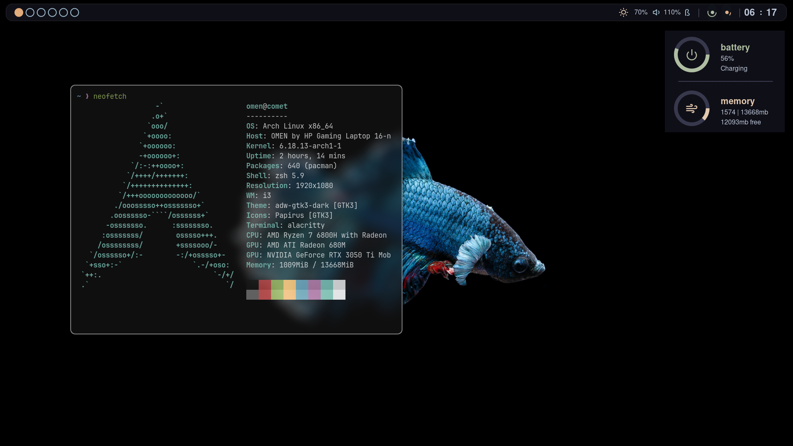
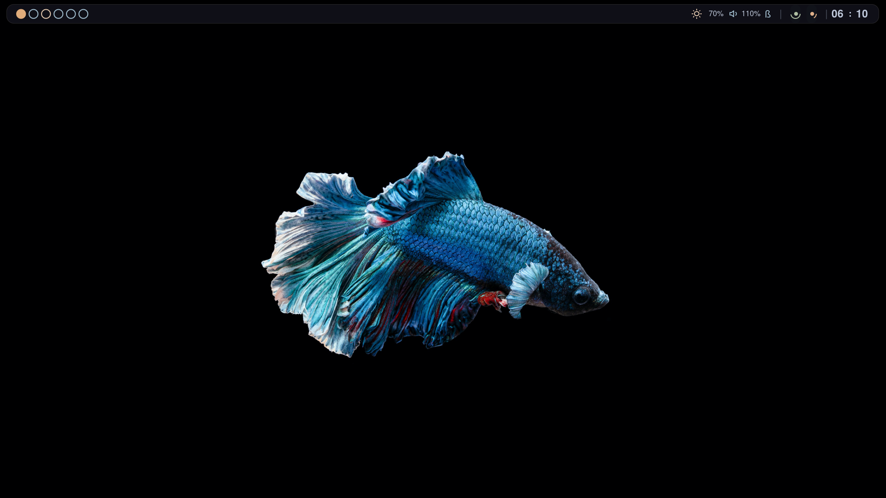
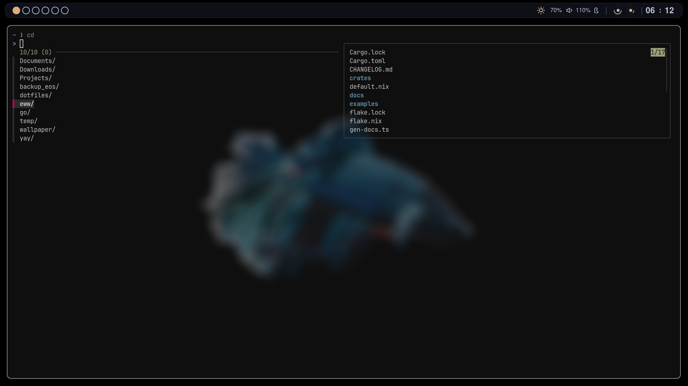

# Dotfiles

A minimal, modern i3-based Linux desktop configuration for Arch Linux. Features an EWW status bar, Rofi app launcher, Picom compositor with animations, and a cohesive dark theme.

## Screenshot






---

## Overview

| Component | Description |
|-----------|-------------|
| **Window Manager** | i3 (with gaps) |
| **Status Bar** | EWW |
| **App Launcher** | Rofi |
| **Terminal** | Alacritty |
| **Compositor** | Picom (animations, blur, rounded corners) |
| **File Manager** | Thunar |
| **Shell** | Zsh with Powerlevel10k |
| **Theme** | adw-gtk3-dark, Papirus icons |

---

## Dependencies

### Core (Required)

| Package | Purpose |
|---------|---------|
| `i3` | Window manager |
| `i3lock` | Screen lock |
| `dex` | XDG autostart for i3 |
| `xss-lock` | Lock screen before suspend |
| `network-manager-applet` | System tray network manager |
| `alacritty` | Terminal emulator |
| `rofi` | Application launcher |
| `picom` | Compositor (animations, transparency, blur) |
| `eww` | Status bar widgets |
| `feh` | Wallpaper manager |
| `thunar` | File manager |
| `flameshot` | Screenshot tool |
| `brightnessctl` | Brightness control |
| `autotiling` | Smart window tiling (i3) |
| `pulseaudio` / `pulseaudio-alsa` | Audio (volume scripts) |
| `jq` | JSON parsing (eww workspace script) |

### Fonts

| Package | Used By |
|---------|---------|
| `ttf-jetbrains-mono-nerd` | Alacritty terminal |
| `ttf-iosevka-nerd` | Polybar (if used) |
| `ttf-fira-sans` | Rofi |
| `ttf-daddytimemono-nerd` | EWW bar |
| `ttf-font-awesome` | Icons in bars |
| `papirus-icon-theme` | GTK icons |
| `adw-gtk3` | GTK theme |

### Optional (for full functionality)

| Package | Purpose |
|---------|---------|
| `pywal` | Generate color schemes from wallpapers |
| `imagemagick` | Blur wallpapers for Rofi background |
| `neofetch` | System info in terminal |
| `btop` | System monitor |
| `mpd` | Music player (for EWW music widget) |
| `ffmpeg` | Extract album art for MPD |
| `firefox` | Browser (Mod+b) |
| `code` | VS Code (Mod+z) |
| `exo` | Thunar "Open Terminal Here" (exo-open) |
| `ly` | Display manager (TUI login; optional alternative to SDDM/GDM) |


## Installation

### 1. Clone the repository

```bash
git clone https://github.com/YOUR_USERNAME/dotfiles.git ~/dotfiles
cd ~/dotfiles
```

### 2. Install dependencies (Arch Linux)

```bash
# Core packages
sudo pacman -S i3 i3lock xss-lock network-manager-applet alacritty rofi \
  picom feh thunar flameshot brightnessctl pulseaudio pulseaudio-alsa jq \
  ttf-jetbrains-mono-nerd ttf-fira-sans ttf-font-awesome papirus-icon-theme adw-gtk3

# Autotiling (from AUR)
yay -S autotiling

# Optional
sudo pacman -S pywal imagemagick btop mpd ffmpeg firefox
```

### 3. Run the install script (optional)

```bash
cd ~/dotfiles
chmod +x install.sh
./install.sh
```

This creates symlinks for all config files.

### 4. Install EWW

EWW must be built from source or installed via AUR. The config expects `eww` at either:
- `/usr/local/bin/eww`
- `~/.local/bin/eww/eww`

Ensure the binary is in your PATH.

### 4. Stow or symlink configs

**Using GNU Stow**

```bash
cd ~/dotfiles
stow -t ~ .
```

### 5. Wallpaper and feh

Set a wallpaper and generate the blurred version for Rofi:

```bash
# Set wallpaper (creates ~/.fehbg)
feh --bg-fill /path/to/wallpaper.jpg

# Or use the change_wallpaper script (generates pywal colors + blurred bg)
~/.config/scripts/change_wallpaper.sh /path/to/wallpaper.jpg
```

### 6. Power menu symlink

```bash
sudo ln -sf ~/.config/rofi/scripts/power-menu.sh /usr/local/bin/rofi-powermenu
chmod +x ~/.config/rofi/scripts/power-menu.sh
```

### 7. Zsh setup (Powerlevel10k)

On first login with zsh, Zinit will auto-install. Then run:

```bash
p10k configure
```

### 8. Select i3 at login

Log out and choose **i3** (or i3 with Xorg) from your display manager.

---

## Ly Display Manager Setup

[Ly](https://codeberg.org/fairyglade/ly) is a lightweight TUI display manager that works well with i3.

### Install Ly

```bash
sudo pacman -S ly xorg-xauth
```

### Enable Ly at boot

Ly replaces the getty on a TTY. Choose a TTY (typically `tty1`):

```bash
sudo systemctl enable ly@tty1.service
sudo systemctl disable getty@tty1.service
```

### Configure Ly for i3

Create `~/.xinitrc` so Ly starts i3 when you log in:

```bash
echo 'exec i3' > ~/.xinitrc
```

Ly uses `~/.xinitrc` by default (see `xinitrc` in `/etc/ly/config.ini`). At the Ly login screen, select the **xinitrc** session (or **i3** if it appears from `/usr/share/xsessions/`).

### Reboot

```bash
sudo reboot
```

Ly will show on TTY1. Log in with your username and password; i3 will start automatically.

### Optional: Ly user config

User-specific Ly settings go in `~/.config/ly/config.ini`. System-wide config is in `/etc/ly/config.ini`.

---

## Key Bindings

| Key | Action |
|-----|--------|
| `Mod+Return` | Open terminal (Alacritty) |
| `Mod+d` | Rofi app launcher |
| `Mod+q` | Close window |
| `Mod+Shift+e` | Exit i3 |
| `Mod+Shift+e` | Reload config |
| `Mod+e` | Thunar file manager |
| `Mod+b` | Firefox |
| `Mod+z` | VS Code |
| `Mod+Ctrl+q` | Power menu |
| `Mod+r` | Resize mode |
| `Mod+f` | Fullscreen |
| `Print` | Flameshot screenshot |
| `XF86Audio*` | Volume up/down/mute |
| `XF86MonBrightness*` | Brightness |

---

## File Structure

```
dotfiles/
├── .zshrc
├── .config/
│   ├── i3/config          # Main i3 config
│   ├── eww/bar/           # EWW status bar
│   ├── rofi/              # App launcher + power menu
│   ├── picom/             # Compositor
│   ├── alacritty/         # Terminal
│   ├── scripts/           # volume.sh, change_wallpaper.sh
│   ├── neofetch/
│   ├── btop/
│   ├── gtk-3.0/
│   ├── Thunar/
│   └── mimeapps.list
└── README.md
```

---

## Customization

- **Colors:** Edit `eww.scss` for EWW or `~/.config/polybar/colors.ini` for polybar.
- **Rofi:** Edit `~/.config/rofi/config.rasi` and `power-menu.rasi`.
- **i3 gaps:** Adjust `gaps inner` and `gaps outer` in `~/.config/i3/config`.
- **Fonts:** Alacritty uses JetBrains Mono Nerd Font; change in `alacritty.toml`.

---

## Troubleshooting

### EWW bar not showing
- Ensure `eww` is installed and in PATH.
- Check `~/.config/eww/bar/launch_bar` and run it manually to see errors.
- Volume script uses `/usr/local/bin/eww`; adjust if your eww is elsewhere.

### Rofi has no background
- Run `wal -i /path/to/wallpaper` to generate `~/.cache/wal/colors-rasi-pywal.rasi`.
- Ensure `~/.cache/blurred_wall.jpg` exists.

### Volume keys not working
- Install `pulseaudio` and `pulseaudio-alsa`.
- Ensure `~/.config/scripts/volume.sh` is executable.

---

## Inspiration & References

- **[saimoomedits/eww-widgets](https://github.com/Saimoomedits/eww-widgets)** — EWW bar and widgets
- **[dreamsofautonomy/zensh](https://github.com/dreamsofautonomy/zensh)** — Zsh configuration
- **[Unixporn Dots](https://unixporn-dots.github.io/)** — Community dotfiles collection

---

## Upcoming

- **Music player widget** — EWW-based music player widget (in progress)

---
